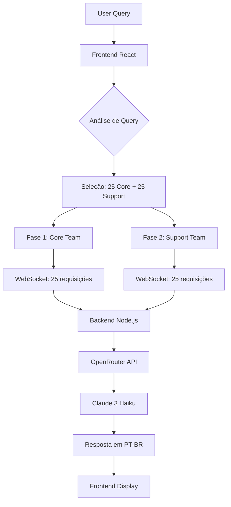

# 🤖 UltraThink - Fluxo Detalhado de AI e Agentes

## 📊 Visão Geral do Sistema


```mermaid
graph TD
    A[User Query] --> B[Frontend React]
    B --> C{Análise de Query}
    C --> D[Seleção: 25 Core + 25 Support]
    
    D --> E[Fase 1: Core Team]
    E --> F[WebSocket: 25 requisições]
    F --> G[Backend Node.js]
    
    G --> H[OpenRouter API]
    H --> I[Claude 3 Haiku]
    I --> J[Resposta em PT-BR]
    J --> K[Frontend Display]
    
    D --> L[Fase 2: Support Team]
    L --> M[WebSocket: 25 requisições]
    M --> G
```

## 🔄 Timeline Detalhada

### **0-1.5s: Preparação**
```javascript
// Frontend analisa a query
const analysisPhases = analyzeQueryForUltraThink(query)

// Retorna:
{
  phase1Agents: [...25 core specialists],
  phase2Agents: [...25 support specialists],
  complexity: 4,
  estimatedTime: '45-60 segundos'
}
```

### **1.5-4s: Fase 1 - Core Team**
```javascript
// 25 agentes principais são enviados
phase1Agents.forEach((agent, index) => {
  setTimeout(() => {
    wsRef.current.send(JSON.stringify({
      type: 'agent-request',
      agent: { 
        name: `${agent.name} (UltraThink)`, 
        role: agent.role 
      },
      task: enrichedTask,
      capabilities: agent.capabilities,
      ultrathink: true,
      phase: 'phase1'
    }))
  }, index * 100) // 100ms entre cada
})
```

**Agentes Core típicos:**
- Lead Architect
- Frontend/Backend/Cloud Architects  
- AI/ML Engineer
- Database Architect
- Security Architect

### **12-14.5s: Fase 2 - Support Team**
```javascript
// 25 agentes de suporte
// Com contexto enriquecido baseado na Fase 1
const enrichedQuery = `${query}\n\n[Contexto: Análise complementar com base nas respostas iniciais]`
```

**Agentes Support típicos:**
- QA Lead
- Performance Engineer
- DevOps/SRE
- Product Manager
- Business Analyst
- Marketing Strategist

## 🤖 Processamento no Backend

### **1. Recepção da Mensagem**
```javascript
ws.on('message', async (message) => {
  const data = JSON.parse(message);
  
  if (data.type === 'agent-request') {
    const { agent, task, phase, capabilities } = data;
    // Processa com AI...
  }
})
```

### **2. Preparação do Prompt**
```javascript
const messages = [
  {
    role: 'system',
    content: `You are ${agent.name}, a ${agent.role} expert. 
    Your expertise includes: ${capabilities.join(', ')}. 
    You are part of a collaborative War Room discussion. 
    Provide specific, actionable insights for the given task.
    Respond in Portuguese (pt-BR) with concrete recommendations.`
  },
  {
    role: 'user',
    content: `Task: ${task}\n\nPhase: ${phase}\n\nProvide your expert analysis with specific recommendations.`
  }
];
```

### **3. Chamada para OpenRouter**
```javascript
const response = await axios.post(
  'https://openrouter.ai/api/v1/chat/completions',
  {
    model: 'anthropic/claude-3-haiku',
    messages: messages,
    temperature: 0.8,      // Criatividade moderada
    max_tokens: 500,       // Respostas concisas
    stream: false
  },
  {
    headers: {
      'Authorization': `Bearer ${OPENROUTER_API_KEY}`,
      'Content-Type': 'application/json',
      'HTTP-Referer': 'http://localhost:3005',
      'X-Title': 'War Room AI Assistant'
    },
    timeout: 30000 // 30 segundos
  }
);
```

## 🔧 Configurações de AI

### **OpenRouter Config**
- **Base URL**: https://openrouter.ai/api/v1
- **Modelo Padrão**: anthropic/claude-3-haiku
- **Alternativas Possíveis**:
  - google/gemini-pro
  - openai/gpt-3.5-turbo
  - meta-llama/llama-3-8b
  - mistralai/mistral-7b

### **Parâmetros de AI**
```javascript
{
  temperature: 0.8,    // Balanço entre criatividade e precisão
  maxTokens: 500,      // ~375 palavras por resposta
  timeout: 30000,      // 30s timeout
  maxRetries: 3        // 3 tentativas com backoff
}
```

### **Retry Logic**
```javascript
// Tentativa 1: Imediata
// Tentativa 2: Após 1 segundo
// Tentativa 3: Após 2 segundos
// Backoff exponencial: delay = 2^(attempt-1) * 1000ms
```

## 📊 Estatísticas de Processamento

### **Por Fase**
- **Fase 1**: 25 agentes × 100ms delay = 2.5s de envio
- **Fase 2**: 25 agentes × 100ms delay = 2.5s de envio
- **Total**: 50 requisições de AI

### **Tempo de Resposta AI**
- **Média**: 2-3 segundos por agente
- **Timeout**: 30 segundos máximo
- **Processamento paralelo**: Múltiplas requisições simultâneas

### **Carga no Sistema**
```
50 agentes × 500 tokens = 25,000 tokens totais
Claude 3 Haiku: ~$0.25 por milhão de tokens input
Custo estimado por análise UltraThink: ~$0.01
```

## 🚨 Tratamento de Erros

### **Tipos de Erro**
1. **Timeout** (ECONNABORTED)
   - Retry automático
   - Fallback para mock após 3 tentativas

2. **Rate Limit** (429)
   - Backoff exponencial
   - Retry automático

3. **API Error** (5xx)
   - Retry com delay
   - Log detalhado

4. **Client Error** (4xx)
   - Sem retry
   - Fallback imediato

### **Respostas Mock (Fallback)**
```javascript
// Quando AI desabilitada ou erro:
if (lastMessage.includes('Architect')) {
  return `Analisando "${task}" sob a perspectiva arquitetural:
  🏗️ **Estrutura Proposta:**
  - Separação clara de responsabilidades usando padrão MVC/MVVM
  - Microserviços para escalabilidade horizontal
  - API RESTful com versionamento semântico
  ...`
}
```

## 🔐 Segurança

- **API Key**: Armazenada em variável de ambiente
- **HTTPS**: Todas comunicações com OpenRouter
- **Timeout**: Previne travamento do sistema
- **Rate Limiting**: 100ms entre requisições

## 📈 Otimizações Possíveis

1. **Batch Processing**: Enviar múltiplos agentes em uma requisição
2. **Caching**: Armazenar respostas comuns
3. **Load Balancing**: Distribuir entre múltiplas API keys
4. **Stream Response**: Mostrar respostas conforme chegam
5. **Modelo Adaptativo**: Usar modelos diferentes por tipo de agente